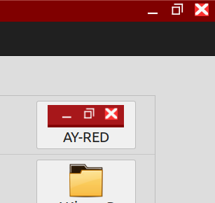

# AY-RED

AY-RED has the border theme and controls theme.   I use it mainly for the controls.   It is a darker theme and no transparency.
AKoranage is another border theme only, they are clones of each other with color changes, icons, and a few dimensions.

Note: I also have a 2 Icon Theme repositories that you may want to download.

INSTALLATION:
Copy the AY-RED folder into ~/.themes folder for personal use.
Copy to /usr/share/themes for global use.
Use Settings->Themes to select the theme for borders and or controls.

